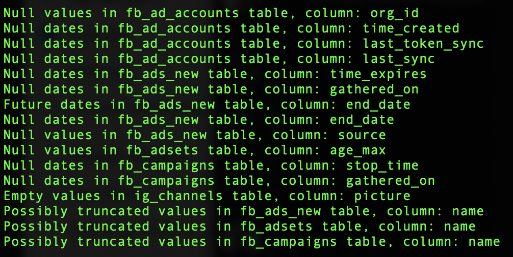

Kobold is a NodeJS proof of concept command line tool to automatically scans all MySQL tables for bad data. It automatically detects the column type and runs the appropriate default checks for : numbers, strings and dates.

#### Initial setup
- Install [NodeJS](https://nodejs.org/en/)
- Download/Checkout Kobold's source
- Run: `npm install` from within Kobold's directory

#### Usage 
`node ./check_data.js [host] [database] [username] [password]`

#### Customization
To exclude individual tables from the scan, add them to the array in `getTablesToIgnore()` function in `configuration.js` file.

To enable/disable individual checks on specific columns, add/remove them from `getCustomColumnChecks()` in `configuration.js` file.

#### Sample Result

